```{r setup, include=FALSE}
knitr::opts_chunk$set(echo = TRUE)
```

# Introduction

I am investigating Coronary Heart Disease (CHD) prevalence rates in North Carolina. On a census tract level, are health behaviors and use of prevention services associated with CHD prevalence? Census tracts are a geographical unit that divide the entire state with complete geographic coverage 1. North Carolina has only 100 counties, but 2195 census tracts, allowing for a large sample size and greater power 2.  They are also beneficial due to their increased specificity and infrequent boundary changes. This analysis is ecological, with conclusions drawn at the census-tract level.

To answer the research question, I used PLACES 2022 data release from the CDC 3. This dataset includes gata gathered from the 2020 Behavioral Risk Factor Surveillance System (BRFSS), the 2010 census, and American Community Survey 2015–2019. The Behavioral Risk Factor Surveillance System is an annual telephone survey of the adult population (aged ≥18 years) of the 50 states, DC, and US territories. BRFSS completes more than 400,000 adult interviews each year and it is the largest continuously conducted health survey system in the world. The dataset includes estimates for 29 measures of health-related data including health outcomes, use of preventative services, health risk behaviors, and health status. For the analysis, I looked more in depth at prevalence of health risk behaviors and prevention measures among adults as possible predictors of CHD prevalence rate.

For this analysis, I began with a full model including 14 covariates with CHD prevalence (as a percentage of census-tract population) as the response variable. All covariates are estimated crude prevalence of health risk behaviors and prevention measures, in units of percentages. The analysis plan includes establishing the full model, evaluating the descriptive statistics of its variables, and a preliminary check of the assumptions to determine if transformation is necessary. Then, I perform a backwards stepwise selection at the 0.05 level to reduce the model and evaluate for collinearity using  VIF values to further reduce and finalize the model. In the final model, I rechecked our assumptions and looked at our p-value, F-statistic, and R2 value to determine the significance of the model and how well the covariates can predict CHD prevalence at the census-tract level.

# Background

About 610,000 people die of heart disease in the United States every year and heart disease is the leading cause of death for both men and women. Coronary heart disease  is the most common type of heart disease, 20.5 million U.S. adults have coronary artery disease. CHD is also the deadliest form of heart disease, killing over 370,000 annually in the United States 4. The average CHD prevalence in the United States is 7%; 8.3% for men and 6.1% for women.

CHD is often caused by cholesterol, a waxy substance that builds up inside the lining of the coronary arteries, forming plaque. This plaque buildup can partially or totally block blood flow in the large arteries of the heart (the most common cause of a heart attack). While symptoms of CHD vary from person to person, many individuals do not have any symptoms. This makes CHD particularly dangerous since many individuals do not know they have coronary heart disease until they have chest pain, a heart attack (blood flow to the heart is blocked), or go into cardiac arrest (the heart suddenly stops pumping blood). 

For most people, CHD is preventable with healthy lifestyles and medication. A healthy lifestyle includes getting enough quality sleep, eating foods with lower levels of saturated fat, sodium, and added sugars, not smoking, 2.5 hours of moderate exercise, etc. 

# Variables of Interest

### Outcome Variable

**Crude Coronary Heart Disease Prevalence (%)**

  - Among adults aged ≥18 years
  - At census tract level
  - Self Reported
  
The question asked in the survey was “Has a doctor, nurse, or other health professional ever told you that you had angina or coronary heart disease” 

  - YES
  - NO
  - Don't Know or Not Sure 

$$
\frac {Responded \;YES \;to \;having \;been \;diagnosed \;with \;CHD}{Responded \;YES \;or \;NO \;to \;having \;been \;diagnosed \;with \;CHD} *100
$$

### Predictor Variables

**Health Risk Behaviors:**

  - Binge drinking
  - Current smoking
  - No leisure-time physical activity 
  - Sleeping less than 7 hours
  
**Prevention:**

  - Cervical cancer screening among women
  - Cholesterol screening
  - Current lack of health insurance
  - Fecal occult blood test, sigmoidoscopy, or colonoscopy among adults aged 50-74 years
  - Mammography use among women aged 18-64 years
  - Older adult men >=65 years who are up to date on a core set of clinical preventive services
  - Older adult women >=65 years who are up to date on a core set of clinical preventive services
  - Taking medicine for high blood pressure control among adults with high blood pressure
  - Visits to dentist or dental clinical
  - Visits to doctor for routine checkup within the past year


# Exploratory Data Analysis

I conducted a bit of exploratory data analysis to check if there were any obvious trends or associations in this data set. 

I first checked the distribution of the Coronary Heart Disease Prevalence variable. It seems fairly normally distributed and centered between 6% and 7.5% prevalence. 


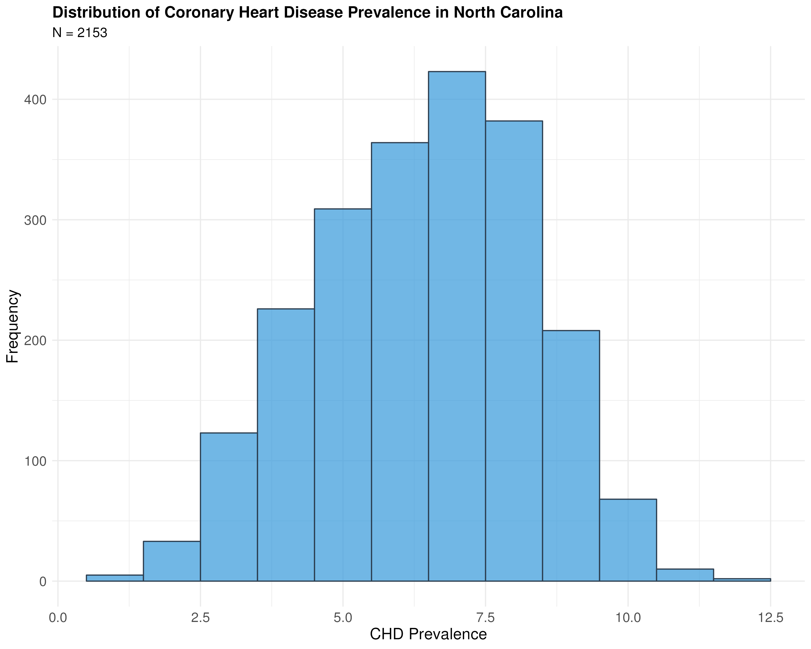 

Next, I looked at the correlation matrix of my selected variables so see if there were any potentially correlations variables. There seems to be a lot of correlation and there is potentially issues with multicollinearity that may need to be addressed. 

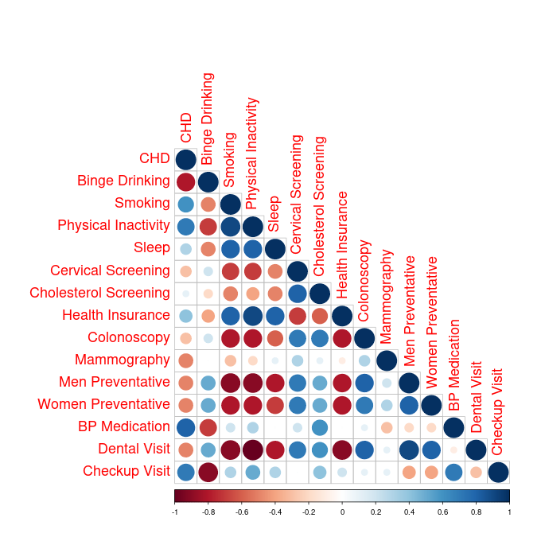 

I also created a map of North Carolina, with the average CHD prevalence of each county displayed. I then overlaid the five census tracts that had the highest coronary heart disease prevalences and the five with the lowest prevalences. The table with the these census tracts is also desplayed below. The census tracts with the highest CHD prevalence are in Carteret, Lenior, Henderson, Warren, and Wilson counties. The CHD prevelance of the census tract in Carteret is 12.5%, more than 5% higher than the national average. The census tracts with the lowest CHD prevalence are in Orange, Craven, Onslow, and Cumberland counties. The CHD prevelance of the census tract in Carteret is 0.9%. 

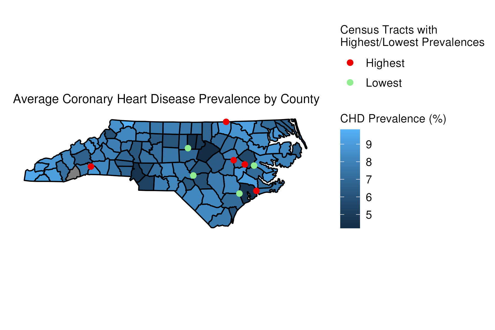 

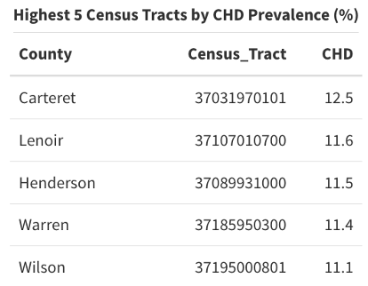 

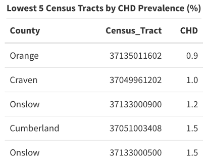


From my background research, I know that medical and public health professionals recommended a healthy lifestyle that included not smoking. I also know that CHD is often caused by cholesterol. Thus, I compared the CHD prevalences map of North Carolina to two new maps, one of cholesterol screening prevalences and one of current smoking prevalences. You can see from the overlaid census tracts on these maps that there is some overlap. In particular, Lenior and Wilson counties had some of the highest prevalences for both CHD and smoking. Additionally, one of the Onslow census tracts had one of the lowest prevalences for both CHD and cholesterol screening. 

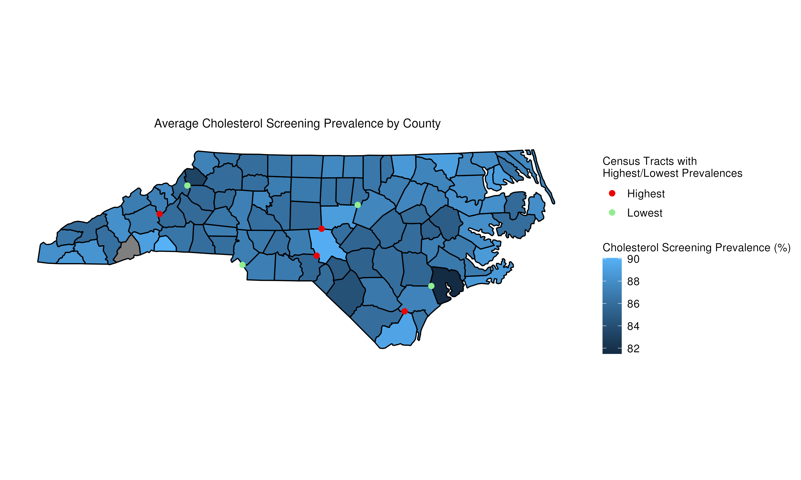

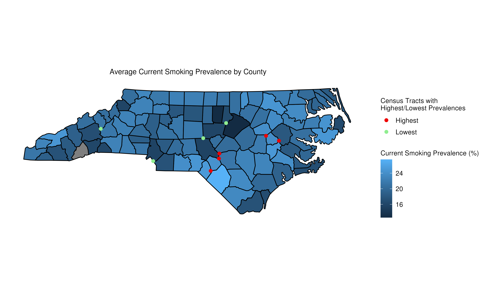


# Analysis

## Full Model

The full model compared coronary heart disease prevalence with all the main effects of health risk behaviors and prevention services. The outcome variable was coronary heart disease prevalence and the predictors included binge drinking, current smoking, physical inactivity, sleep less than 7 hours, cervical cancer screening, cholesterol screening, health insurance, colorectal cancer screening, mammogram, core preventative services for older men, core preventative services for older women, taking blood pressure medication, visits to dentist, and visits to doctor for routine checkup. 


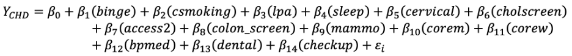


## Descriptive Statistics and Assumptions

In this data set, less than 1% (16 of 2169) of the observations had missing values for at least one of our 14 covariates. While I proceeded with this relatively small number of observations excluded from our analysis, it is worth mentioning that all 16 of these census tracts had CHD crude prevalence values below the median (6.60% prevalence). The remaining sample size consisted of 2153 census tracts prior to reducing our model. Inspection of the statistics and box plots of the variables revealed relatively symmetric spreads for most of the variables (Figure 1). The more extreme crude prevalence values appeared to be realistic and plausible, with no evident errors in the outliers on preliminary inspection. While there appears to be at least one variable (BPMED) that has a noticeably asymmetric distribution, I held off on transformation of any variables until after evaluating the residual plots of our full model.


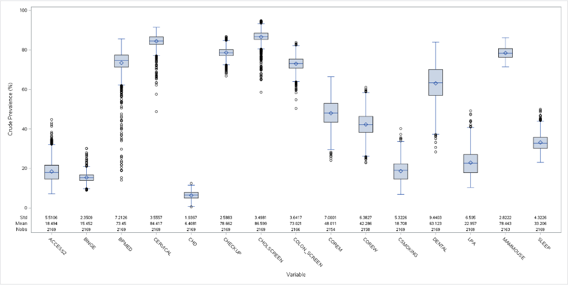

I first checked the assumptions of the full model to assess if any transformations were needed. I recognize that the independence assumption may be violated since we are working with census tracts. I will discuss this further in the discussion section and suggest possible solutions to mitigate violating this assumption. I assessed the assumption that there is a linear relationship between the predictors and CHD prevalence by looking at the residual plot (Figure 2). It is clear to see from the residual plot that the linearity assumption is violated - leading me to think a transformation may be necessary. I also looked at the residual plot to assess homoscedasticity or that there is constant variance among the residual. This assumption also appears to be violated. Additionally, to assess normality or that residuals are normally distributed, I checked the QQ plot (Figure 3). The QQ plot also indicated that the normality assumption was violated - further leading me to believe a transformation was necessary. Finally, I inspected the residual plots of the predictors for CHD and saw that they appeared normal except for the blood pressure medication predictor (Figure 4). I decided to also transform this predictor to normalize the residuals. 


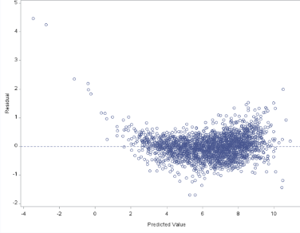

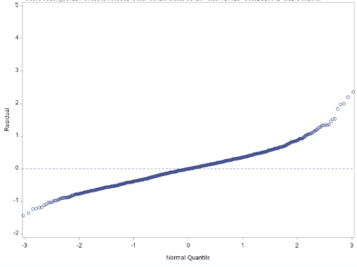

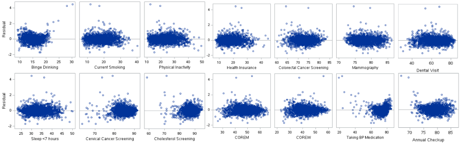

## Transformations

To address these departures from the model assumptions, I first investigated possible transformations to the variable measuring prevalence of taking blood pressure medication (BPMED). After testing square-root, logarithmic, quadratic, and cubic transformations, I found that the cubic transformation of this variable allowed for the best fit of the data (Figure 5). After adjusting this variable, I performed a Box-Cox transformation to find the optimal transformation of our CHD variable. The suggested transformation from this procedure was a square-root transformation (Figure 6). Therefore, I replaced our CHD and BPMED variables with SQRT_CHD and BPMED_CUB. Evaluation of the resulting QQ plot and residual plots indicated that these adjustments led to an overall better fit of our data in terms of normality and homoscedasticity. After finalizing our transformations to the CHD and BPMED variables, we proceeded to further reduce our model.


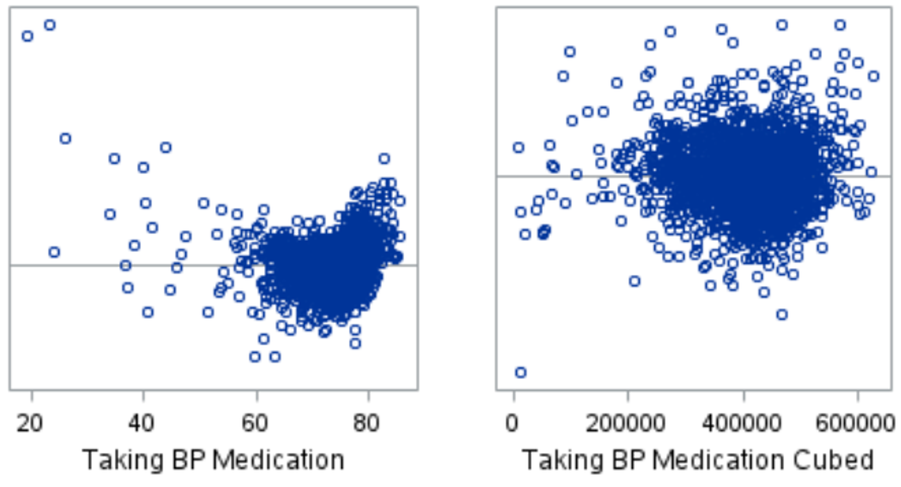

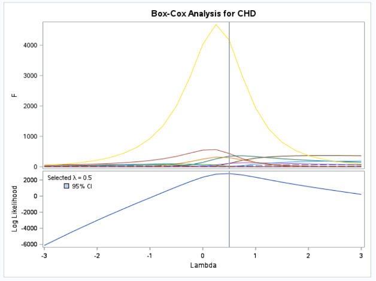
## Model Reduction

I conducted backwards stepwise selection to remove insignificant covariates and find a reduced model that best explains the data. Beginning with the full, transformed model and removed the least significant variables one after the other using a p-value > 0.05 as the elimination threshold. The backwards elimination procedure selected four predictors to eliminate since they had p-values above the 0.05 threshold: Colorectal cancer screening (COLON_SCREEN), binge drinking (BINGE), core preventive services for older women (COREW), and annual checkup (CHECKUP) (Figure 7). 


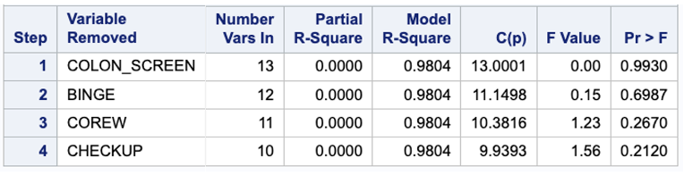

In order to assess collinearity, I inspected the variance inflation factor values and condition indices for the correlation matrix of the remaining predictors. The VIF value for physical inactivity (LPA) and dental visits (DENTAL) were fairly high, 67.3 and 34.5 respectively. I chose to remove the physical inactivity covariate and once it was removed the VIF values were all fairly low; dental visits remaining the highest with 21.6 (Figure 8). Next, I checked the correlation matrix eigenvalues and condition indices. The condition indices were also all low, under 30, including dental visits (Figure 9). This indicates that there is no significant correlation among the remaining predictors and, therefore, I did not choose to remove any additional predictors. 


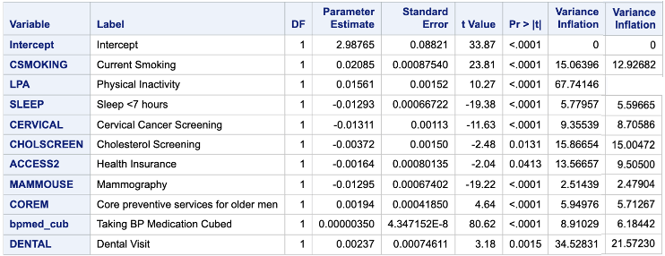

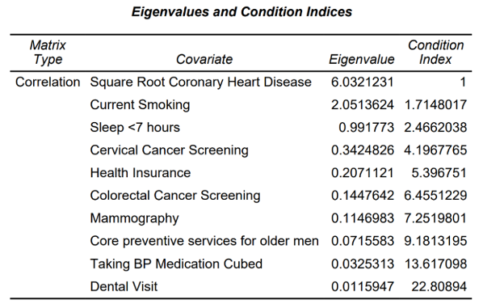
## Reduced Model

The final reduced model included the outcome variable square root transformed coronary heart disease prevalence and the predictors included current smoking, sleep less than 7 hours, cervical cancer screening, cholesterol screening, health insurance, mammogram, core preventative services for older men, cubic transformed blood pressure medication, and visits to dentist. 


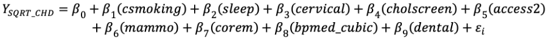

## Final Assumptions

When reassessing the assumptions for the final reduced model you can see that all the assumptions are now met. The linearity assumption or that there is a linear relationship between the predictors and square root transformed CHD prevalence is clearly met when looking at the residual plot (Figure 10). The residual plot also shows that the homoscedasticity assumption is met and that there is constant variance among the residuals. Additionally, the normality assumption or that residuals are normally distributed is seen in the QQ plot (Figure 11). Finally, it was shown in Figure 5 that the residual plots of the predictors for square root transformed CHD were normalized and the only non-normal predictor, taking blood pressure medication, was cubically transformed and then normalized. The independence assumption still may not be met, but again that will be discussed in the discussion section. 

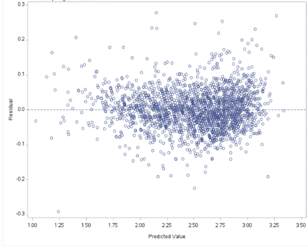
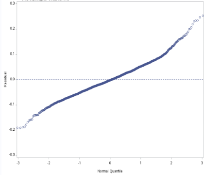

# Discussion and Conclusion

The final reduced and transformed model had an `R^2` value of 0.979, which indicates that the 9 predictors create an excellent fit for the data (Figure 12). The ANOVA model has an F-statistic of 11123.3 and a p-value of <0.0001, making the model is significant at the 𝛼 = 0.05 level. As established from the backwards stepwise selection and collinearity assessment, the 9 covariates are also significant at this level 𝛼 = 0.05 level. 

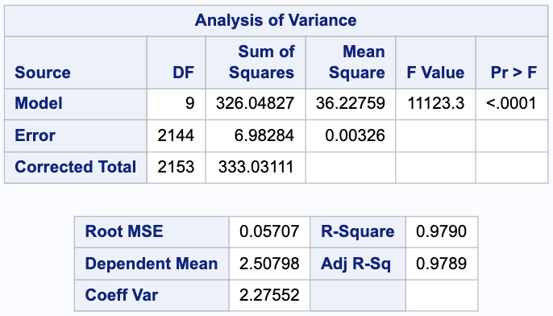

The intercept of the model indicates that a census tract with 0% prevalence of smoking, sleeping under 7 hours, cervical cancer screenings, etc. for all covariates would have an estimated square root prevalence of 3.3. This corresponds to a 10.8% prevalence of CHD when all covariates have a 0% prevalence. The parameter estimate for current smoking was 0.024. This indicates that if a census tract’s prevalence of smoking increased by 1%, with the other covariates held constant, square root prevalence of CHD would increase by .024% on average. The other parameter estimates can be interpreted similarly.

Overall, even though `R^2` was high (0.979) and p-values were statistically significant, many of the parameter estimates were close to 0, indicating that results may not be clinically significant. One of the strengths of this analysis was the large sample size, which greatly increased the power. However, I realize that this study may have been overpowered, as it was able to detect such mild associations with little clinical significance. 

A limitation of this analysis is the self-reported sample surveys which might be subject to systematic error from noncoverage, nonresponse, or measurement bias. Additionally, since the outcome based on being diagnosed by a physician and the respondent’s recall of the diagnosis, this analysis might underestimate the true prevalence

This is just a leading case, future analyses could attempt to address the violation of independence assumption by using other methods without this assumption or using different forms of geographical units. Other analyses could also use other models, including model classification and selection through k-fold cross validation, gradient boosting machines, or ridge regression techniques. I was limited to only using a linear model, since that was a requirement for this project. 

In conclusion, health behaviors and prevention service usage is associated with CHD prevalence. Overall, census tracts with low service utilization and high prevalence of risky health behaviors could be targets of preventative programs and services.

### Acknowledgements

Work completed for BIOS 663 through the Department of Biostatistics at UNC Chapel Hill. 
Thank you to my work group collaborators Annie Page and Randy Fakhreddin. 

### Sources

**Introduction and Background Citations:**

1. UCF Research Guides: Statistics, demographics and census. ZIP Code > Census Tracts - Statistics, Demographics and Census - UCF Research Guides at University of Central Florida Libraries. https://guides.ucf.edu/statistics/zip. 

2. Bureau USC. North Carolina. Census.gov. Published October 8, 2021. https://www.census.gov/geographies/reference-files/2010/geo/state-local-geo-guides-2010/north-carolina.html#:~:text=CENSUS%20TRACTS%2FBLOCK%20GROUPS%2FBLOCKS,groups%2C%20and%20288%2C987%20census%20blocks.
 
3.	Places: Local data for better health, Census Tract Data 2022 release. Centers for Disease Control and Prevention. https://chronicdata.cdc.gov/500-Cities-Places/PLACES-Local-Data-for-Better-Health-Census-Tract-D/cwsq-ngmh. 

4. What is coronary heart disease? National Heart Lung and Blood Institute. Published December 20, 2023. https://www.nhlbi.nih.gov/health/coronary-heart-disease. 

